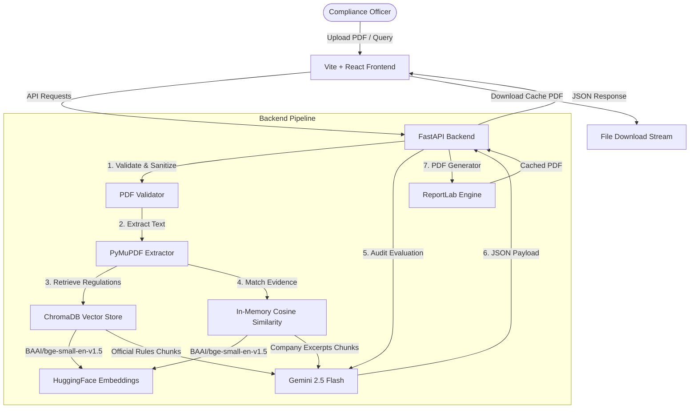

# 🏛️ FinReg — AI-Powered Corporate Compliance Intelligence Platform

[](https://opensource.org/licenses/MIT)
[](https://fastapi.tiangolo.com)
[](https://react.dev)
[](https://tailwindcss.com)
[](https://www.trychroma.com)

FinReg is an enterprise-grade AI compliance platform designed to automate the auditing of corporate reports, board resolutions, and financial statements against the **Indian Companies Act, 2013** and MCA statutory rules.

Leveraging semantic **Retrieval-Augmented Generation (RAG)**, local dense vector embeddings, and evidence-backed AI reasoning, FinReg turns hours of manual auditing into a one-click automated gap analysis.

---

## 🏗️ Architecture




---

## ✨ Features

*   **Unified compliance endpoint**: Consolidated pipeline combining text extraction, RAG matching, Gemini compliance evaluation, and PDF report creation.
*   **Persistent ChromaDB vector search**: Indexes statutory laws utilizing HuggingFace's `BAAI/bge-small-en-v1.5` embeddings.
*   **Evidence-backed AI auditor**: Compares company excerpts side-by-side with official legal clauses and generates compliance statuses (`Met`, `Partial`, `Gap`) and actionable remediations.
*   **One-click professional PDF downloads**: Renders beautiful multi-page compliance roadmaps, gap matrices, and citations via ReportLab.
*   **Context-sensitive empty states**: Adapts to dashboard filters to provide user-friendly success checkmarks and diagnostic guidance.
*   **Lifespan resource preloading**: Pre-initializes AI models and vector databases at startup to avoid runtime request delays.
*   **Production-grade security**: Limits uploads strictly to `<10MB` PDFs, sanitizes input filenames, and masks raw API exceptions or internal paths.

---

## 🛠️ Tech Stack

*   **Backend**: Python, FastAPI, PyMuPDF (fitz), LangChain
*   **Frontend**: Vite, React, TypeScript, TailwindCSS, Radix UI, Lucide Icons
*   **Database**: ChromaDB (Vector database)
*   **AI Engine**: Gemini 2.5 Flash, HuggingFace embeddings (`BAAI/bge-small-en-v1.5`)

---

## 📸 Screenshots

*Placeholder: Place dashboard, upload wizard, and generated report PDF screenshots here.*

---

## 📁 Folder Structure

```
FinReg/
├── backend/
│   ├── main.py                     # FastAPI application & API endpoints
│   ├── professional_enhanced_compliance.py # RAG matching and ReportLab generator
│   └── utils.py                    # PyMuPDF text extraction helpers
├── finregFrontend/
│   ├── src/
│   │   ├── pages/
│   │   │   ├── Dashboard.tsx       # Interactive Compliance Officer Dashboard
│   │   │   └── Landing.tsx         # Enterprise Landing Page
│   │   ├── App.tsx                 # Client routing configurations
│   │   └── main.tsx                # Frontend entrypoint
│   └── package.json                # Frontend package requirements
├── regulations/                    # Official regulatory PDFs (e.g. Companies Act)
├── tests/                          # Automated test cases
│   ├── fixtures/                   # Test input documents (test_compliance.txt, etc.)
│   ├── test_pdf_report.py          # Standalone PDF pipeline test
│   ├── test_retrieval.py           # ChromaDB search checks
│   └── test_api.py                 # HTTP API endpoints checks
├── reports/                        # Cached generated compliance PDFs (Git ignored except .gitkeep)
├── docs/                           # Project documentation
├── ingest.py                       # Ingestion runner for ChromaDB population
├── startup.py                      # Vector database setup & server launcher
├── .env.example                    # Environment template config
└── .gitignore                      # Git ignore specifications
```

---

## 🔧 Environment Variables

Configure these variables in a `.env` file at the project root:

```bash
# Server listener config
API_HOST=0.0.0.0
API_PORT=8000
DEBUG=False

# API Key (Required for compliance RAG evaluation)
GEMINI_API_KEY=your_gemini_api_key_here

# Frontend connection URL
VITE_API_BASE_URL=http://localhost:8000
```

---

## 🚀 Installation & Local Development

### Prerequisites
*   Python 3.11+
*   Node.js 18+

### 1. Backend Installation & Run
1. Create and activate a Python virtual environment:
   ```bash
   python -m venv venv
   # Windows:
   venv\Scripts\activate
   # macOS/Linux:
   source venv/bin/activate
   ```
2. Install Python dependencies:
   ```bash
   pip install -r requirements.txt
   ```
3. Build the persistent Vector Database:
   ```bash
   python ingest.py
   ```
   *Note: This parses the legal files inside `regulations/`, chunks them, computes embeddings, and populates `chroma_db/` locally.*
4. Start the FastAPI server:
   ```bash
   python startup.py
   ```
   The API will listen at `http://localhost:8000`. Access docs at `http://localhost:8000/docs`.

### 2. Frontend Installation & Run
1. Navigate to the frontend directory:
   ```bash
   cd finregFrontend
   ```
2. Install dependencies:
   ```bash
   npm install
   ```
3. Start the local dev server:
   ```bash
   npm run dev
   ```
   The frontend app will launch at `http://localhost:8080`.

---

## ⚡ API Endpoints

### `POST /analyze-compliance`
Audits the uploaded PDF against the Companies Act framework and returns compliance findings.
*   **Body**: `multipart/form-data`
*   **Fields**: `user_document` (File)
*   **Response**:
    ```json
    {
      "report_id": "8e3d64ba-...",
      "overall_score": 85.0,
      "overall_risk": "Low",
      "findings": [
        {
          "requirement_code": "SECTION_134",
          "regulation_name": "Preparation of Financial Statements",
          "status": "Fully Compliant",
          "risk_level": "Low",
          "confidence_score": 95.0,
          "gap_summary": "No significant gaps identified.",
          "reasoning": "...",
          "evidence_company": "...",
          "evidence_regulation": "...",
          "source_citations": "Section 134, Companies Act, 2013",
          "page_numbers": "p. 312 of compliance rules pdf.pdf"
        }
      ],
      "summary": {
        "compliant_count": 7,
        "partially_compliant_count": 1,
        "non_compliant_count": 0,
        "total_count": 8,
        "average_confidence": 92.5,
        "executive_summary": "..."
      }
    }
    ```

### `GET /download-report/{report_id}`
Streams the pre-generated compliance report PDF from cache.
*   **Parameters**: `report_id` (UUID string)
*   **Response**: `application/pdf` (File download stream)

---

## 🔮 Future Improvements

1.  **Distributed Vector Store**: Migrate from local disk-based Chroma storage to a remote vector database cluster (e.g. pgvector or remote Chroma DB server) for horizontally scaled API servers.
2.  **Cache PDF Cleanup Daemon**: Integrate a task runner or background cron job to automatically clean up temporary generated PDF reports older than 24 hours.
3.  **Advanced LLM Reranking**: Apply Cross-Encoder reranking to retrieved chunks to improve query precision prior to LLM submission.

---

## 📄 License

This project is licensed under the MIT License - see the [LICENSE](LICENSE) file for details.